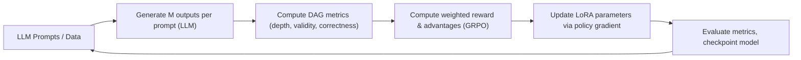

# Training Mistral-7B-Instruct-v0.3 with GRPO and LoRA (Minimising DAG Depth)

**Executive Summary:** We propose fine-tuning the Mistral-7B-Instruct-v0.3 model on a reasoning task with Directed Acyclic Graph (DAG) outputs, using **Group Relative Policy Optimization (GRPO)** for reinforcement learning and **LoRA** (Low-Rank Adaptation) for parameter-efficient tuning. Using an RTX 5090 (32 GB) with mixed precision (e.g. 4-bit quantization and bfloat16), we can fit Mistral-7B with LoRA (rank ~16–32) in memory【11†L109-L118】【31†L21-L29】. GRPO obviates a value network by sampling *N* outputs per prompt, scoring each, and normalizing each score by the group mean and standard deviation【54†L327-L335】. We supply three signals to GRPO: (1) **DAG depth** (to be minimised as a cost); (2) **DAG validity** (binary or score: 1 if the output graph is a valid DAG, else 0); and (3) **DAG correctness** (whether the final answer is correct). The implementation plan uses a **single weighted reward** throughout:
`Reward = w_correct * r_correct + w_valid * r_valid - w_depth * depth - w_invalid * 1[invalid]`.
This keeps training within standard GRPO, makes the objective explicit, and lets us tune the trade-off between short plans, valid graphs, and correct answers without adding a separate constrained-RL layer.

Our training plan includes: curate or generate a DAG-structured QA dataset (with known answers and gold-plan graphs) and format prompts to elicit stepwise reasoning. We would first do a **supervised instruction fine-tuning (SFT)** (perhaps mixing in human QA traces) to initialize, then apply GRPO. The training loop uses Hugging Face Transformers + PEFT: we load Mistral-7B-Instruct with 4-bit quantization and prepare it for k-bit training【11†L93-L102】, attach LoRA adapters (e.g. `LoraConfig(r=16–32, alpha=32–64)`) to attention and MLP projections【11†L109-L118】, and wrap in a PPO/GRPO training loop. For each batch of prompts, we sample *M* outputs per prompt (with top-k or nucleus sampling) and compute rewards from correctness, validity, and depth. The **advantage** for each output is then $(r - \mu)/\sigma$ where $\mu,\sigma$ are the group’s mean/std (implementable in code as shown in GRPO-Zero【54†L327-L335】). We form the GRPO surrogate loss (clipped probability ratios times advantage, plus a small KL penalty to the reference policy to prevent drift)【54†L327-L335】. We periodically merge/snapshot LoRA weights, evaluate metrics (exact match, DAG validity rate, average depth), and enforce safety (e.g. KL penalty, ban degenerate outputs).

**Hardware and Mixed Precision:** The RTX 5090 has 32 GB VRAM and ~90 TFLOPS (FP32)【5†L4-L9】. Using 4-bit quantization with BitsAndBytes and `bfloat16` compute【11†L93-L102】, the Mistral-7B weights occupy only ~3–4 GB, leaving >25 GB for activations. With gradient checkpointing enabled【11†L99-L102】, a per-device batch of ~8–16 sequences (1024 tokens each) can fit; pushing above ~16 sequences risks ~30+ GB usage. For example, one user fine-tuned a 7B model in 8-bit on an 80 GB A100 with batch=7 in ~10 GB【31†L21-L29】, implying an RTX5090 can handle at least a few times larger batch at 4-bit. We summarize approximate memory vs batch trade-offs in Table 1 below. Mixed precision training (4-bit weights + bfloat16 compute) is essential to fit under 32 GB while maintaining model quality【11†L93-L102】【31†L21-L29】.

**LoRA Integration:** We use Hugging Face PEFT’s LoRA to tune only low-rank adapters. Typical LoRA setup for Mistral-7B (see Hugging Face tutorial) uses rank *r*≈16–32 and α≈32–64【11†L109-L118】. For example, Roggendorff (2024) attaches LoRA to key, query, value, output projections and feedforward “up/down” matrices, with dropout~0.05【11†L109-L118】. This adds only *O*(#layers×emb_dim×r) trainable params – just a few million (versus 7B). We might target r=16 to 32 (Table 2) – lower rank is faster but may underfit complex tasks; higher rank (~32+) gives closer-to-full-tune performance (at cost of memory). Integration code snippet:

```python
from transformers import AutoTokenizer, AutoModelForCausalLM, BitsAndBytesConfig
from peft import LoraConfig, get_peft_model

# Quantize model to 4-bit
bnb_config = BitsAndBytesConfig(load_in_4bit=True, bnb_4bit_use_double_quant=True,
                               bnb_4bit_quant_type="nf4", bnb_4bit_compute_dtype=torch.bfloat16)
model = AutoModelForCausalLM.from_pretrained("mistralai/Mistral-7B-Instruct-v0.3", quantization_config=bnb_config)
model.gradient_checkpointing_enable()
model = prepare_model_for_kbit_training(model)

# Attach LoRA adapters
lora_config = LoraConfig(
    r=16, lora_alpha=32, lora_dropout=0.05, bias="none", task_type="CAUSAL_LM",
    target_modules=["q_proj","k_proj","v_proj","o_proj","gate_proj","up_proj","down_proj","lm_head"]
)
model = get_peft_model(model, lora_config)
tokenizer = AutoTokenizer.from_pretrained("mistralai/Mistral-7B-Instruct-v0.3")
```
*Listing: LoRA setup for Mistral-7B (rank=16 shown)【11†L109-L118】.*

**GRPO Algorithm:** Group Relative Policy Optimization generates **M** responses per prompt and uses group statistics as baseline【54†L327-L335】. Concretely, for each prompt *i* we generate outputs $a_{i,1},...,a_{i,M}$ and compute rewards $r_{i,j}$ for each. The advantage for output $j$ is $A_{i,j} = (r_{i,j} - \mu_i)/(\sigma_i + \epsilon)$ where $\mu_i,\sigma_i$ are the group’s mean and std of rewards【54†L327-L335】. The GRPO loss is then the usual clipped PPO surrogate (no separate value network needed) with optional KL-penalty to the frozen reference model. In effect, as a blog notes, **“GRPO eliminates the need for a separate critic/value model, halving memory/compute overhead”**【22†L76-L84】. We will implement GRPO using a custom training loop (e.g. extending [trainer] with advantage normalization). A simplified pseudo-code snippet:

```python
for batch_prompts in dataloader:
    all_sequences, all_logprobs, all_rewards = [], [], []
    for prompt in batch_prompts:
        # Generate M sequences per prompt
        sequences = model.generate(tokenizer.encode(prompt), do_sample=True,
                                   num_return_sequences=M, max_new_tokens=1000)
        rewards = [compute_reward(seq) for seq in sequences]
        mean_r, std_r = np.mean(rewards), np.std(rewards)
        for seq, r in zip(sequences, rewards):
            adv = (r - mean_r) / (std_r + 1e-8)
            # Compute log-prob and policy loss for seq with weight=adv
            logprob = model.log_prob(seq)
            policy_loss = -adv * logprob  # part of PPO surrogate (clip etc. omitted for brevity)
            loss.backward()
    optimizer.step()
```

This follows the GRPO description (see **Policy-Gradient/GRPO-Zero** implementation【54†L327-L335】).

**Reward Design (Weighted Reward Only):** We define three components:
- **DAG Depth:** the maximum length of a reasoning chain in the generated plan. We *minimise* depth (i.e. penalise deep graphs). For reward, we can use $r_{\text{depth}} = -(\text{depth})$ or a normalized form such as $r_{\text{depth}} = -\text{depth}/d_{\max}$.
- **DAG Validity:** a binary indicator (1 if the generated plan is a well-formed DAG with no cycles and valid dependencies; 0 otherwise). Invalid graphs should also receive an explicit penalty term so that malformed outputs are consistently disfavored.
- **Answer Correctness:** whether the final answer matches the gold label. Reward $r_{\text{corr}}=1$ if correct, 0 if wrong. (Optionally partial credit if graded.)

Each response’s total reward is a **single weighted sum**:
\[
r = w_{\text{corr}}\, r_{\text{corr}} + w_{\text{valid}}\, r_{\text{valid}} - w_{\text{depth}}\, \text{depth} - w_{\text{invalid}}\, \mathbf{1}[\text{invalid DAG}].
\]

A practical starting point is to make correctness dominant, validity second, and depth a softer optimization pressure. For example:
- set $w_{\text{corr}}$ highest so shallow but wrong answers are never preferred;
- set $w_{\text{valid}}$ and $w_{\text{invalid}}$ large enough that invalid DAGs are strongly disfavored;
- set $w_{\text{depth}}$ smaller so the model first learns to stay correct and valid, then compresses reasoning depth.

This is the only implementation plan in this document: all three signals are incorporated into one scalar reward and optimized directly with GRPO.

**Training Pipeline:** We propose the following steps:



1. **Data Preparation:** Collect or synthesize a dataset of large-table QA tasks where the solution can be expressed as a DAG of reasoning steps with a correct answer. Format each example with a prompt guiding the model to output a stepwise plan and final answer (e.g. using tags like `<reasoning>...</reasoning><answer>...</answer>`).
2. **Prompt Engineering:** Use structured prompts that instruct the model to output a DAG (for instance, enumerated steps or XML-like tags). Prompts may include few-shot examples showing DAG structure.
3. **Reward Computation:** For each generated output, parse the DAG (via a simple graph parser). Compute depth = longest path length, validity = 1 if parser finds a DAG with all dependencies, correctness = match with gold answer, and combine them with the weighted reward formula above.
4. **GRPO Training Loop:** In each RL batch, sample multiple completions (M per prompt), compute per-output rewards, normalize to advantages, and update model via PPO-style gradient (no critic). Include a small KL divergence term to the frozen reference (initial) model to prevent drift.
5. **Evaluation & Checkpoints:** Periodically evaluate on held-out data: track exact-answer accuracy, average DAG depth, validity rate, and loss. Save model/LoRA checkpoints. Monitor that the model doesn’t exploit the reward (e.g. by outputting trivial but invalid graphs).
6. **Safety/Robustness:** Constrain generation (e.g. max length), use KL penalty as safety (avoid hallucination)【24†L281-L288】, and apply explicit negative reward for malformed or degenerate outputs. Since we control the task, major safety issues are limited to output validity.

**Hyperparameters & Resources:** Initial suggestions: LoRA rank *r*=16–32 (see Table 2); LoRA α=32–64; dropout ~0.05. GRPO group size M≈8–16 (balance diversity vs memory). Learning rate ~1e-5–1e-6 (small for stability). Clip ε≈0.1–0.2 for PPO loss. Use per-device batch of ~4–8 prompts (with gradient accumulation if needed). With RTX 5090, one RL iteration (forward+back) on ~32 sequences (4 prompts × 8 samples each) may take *O*(seconds). Training for ~5k–10k steps could be hours–days. For example, Schoeninger (2025) reports turning a 1B model to a reasoning model with GRPO in a few hours on 16 GB (implying ~10× more compute for 7B)【22†L76-L84】. Expect **tens of hours** on 5090 for full RL fine-tuning (depending on data size). Save checkpoints frequently to avoid loss.

**Tables and Comparisons:**

| **Config**                          | **Batch (seqs)** | **GPU Mem (GB)** | **Notes**                              |
|-------------------------------------|------------------|------------------|----------------------------------------|
| Mistral-7B 4-bit + LoRA (r=16)       | 4 (1024 tok)     | ~18 GB           | Safe margin for training               |
| Mistral-7B 4-bit + LoRA (r=16)       | 8                | ~28 GB           | Near 32GB limit (may require grad ckpt)|
| Mistral-7B 8-bit + LoRA (r=16)       | 8                | ~20 GB           | 8-bit uses more memory than 4-bit      |
| Mistral-7B FP16 (no LoRA/quant)      | 1–2              | ≥32 GB (OOM)     | Full fine-tune not feasible on 32GB    |

*Table 1. Rough GPU memory vs batch trade-offs (seq=sequences of ~1024 tokens) on RTX 5090. These are estimates; actual usage depends on context length and gradient checkpointing. For example, a 7B model in 4-bit was trained under 10 GB with batch=7 on an A100【31†L21-L29】, suggesting 32 GB can handle ~batch 8–16.*  

| **LoRA Rank (r)** | **Trainable Params** | **Approx. Quality Impact**            |
|-------------------|----------------------|--------------------------------------|
| 4                 | ~0.5M                | Fastest training, lower represent.   |
| 16                | ~2M                  | Strong improvement, good trade-off   |
| 32                | ~4M                  | Near full-model performance, slower  |
| 64                | ~8M                  | Diminishing returns, high cost       |

*Table 2. LoRA rank vs trainable parameters and effect. Higher *r* yields more capacity (potentially better accuracy) but more memory/compute. Ranks 16–32 are common choices【11†L109-L118】【26†L56-L64】.*  

| **Reward Component** | **Role in Training** | **Typical Design Choice** |
|----------------------|----------------------|---------------------------|
| Correctness          | Main task objective  | Highest positive weight   |
| Validity             | Structural quality   | Positive reward for valid DAG |
| Invalid DAG penalty  | Strong discouragement of malformed outputs | Large negative penalty |
| Depth                | Efficiency pressure  | Smaller negative weight than correctness |

*Table 3. Weighted reward design used in this implementation. The reward is a single scalar combining correctness, validity, invalidity penalty, and depth. Correctness should dominate, validity should be strongly encouraged, and depth should be optimized only after correctness and validity are stable.*  

**Failure Modes & Mitigation:** Key risks include *reward hacking* (e.g. outputting trivial but “valid” graphs to minimize depth) and *mode collapse*. To mitigate, we anchor to the base model via a KL penalty【24†L281-L288】, filter incoherent outputs, and ensure the weighted reward is calibrated so correctness dominates depth minimization. Invalid outputs should receive a clear negative reward rather than ambiguous treatment. Monitor diversity of outputs. Overfitting to the training prompts is possible; use validation DAG-correctness metrics and early stopping. Low LoRA rank may underfit complex reasoning (mitigate by increasing rank or SFT first). Memory exhaustion is a risk; use gradient checkpointing and offloading if needed.

**References (selected):** Hu *et al.* (2021) introduced LoRA for efficient LLM tuning【26†L56-L64】. Shao *et al.* (2024) propose GRPO as a PPO variant using group baselines【17†L107-L115】【54†L327-L335】. Zhang *et al.* (2025) use DAG-based plans in table QA【39†L85-L94】. Roggendorff (2024) shows LoRA on Mistral-7B【11†L109-L118】. Schoeninger (2025) and `policy-gradient/GRPO-Zero` provide practical GRPO insights【22†L76-L84】【54†L327-L335】.
